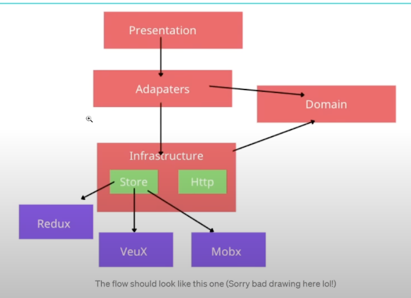
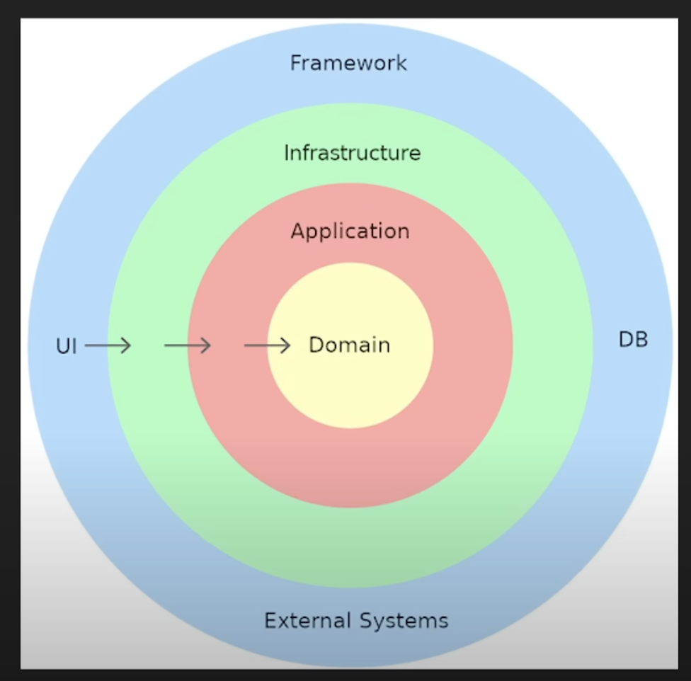

# CLEAN ARCHITECTURE

Trata de brindar una arquitectura la cual sea lo mas ordenada posible, que será ordenada por capas, cada una de estas capaz 
va a tener sus responsabilidades pero lo mas importante es la capa del centro, el dominio( se encarga de las entidades y la logica de negocio):

* **Infraestructure**: Rest / GraphQl / LocalStorage / State (Redux )

* **Services**: call request to third parties / server side.

* **Entities**: the core logic of business domain (does depend on layers) (interfaces de typescript)

* **Use cases**:a data flow - example: when signing up a user, the use case will call UserService to check the
existence of the user before creating

* **Adapters**: Implement specific logic that helps UI  to intereact with the infraestructure. EX: we use Redux as 
state managment in infraestructure, so we need implement an adapter for the redux, we put reducers here.

**The most important thing in this architecture is dependency rule**: the lower layer must not know about the the higher layer.
Then we can keep it testable. Use interface to define the method as a communication.

## Redux

"Single source of truth (store)"

